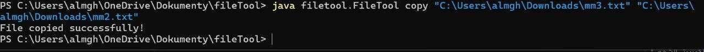
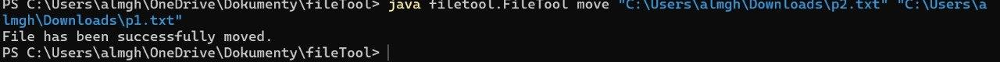
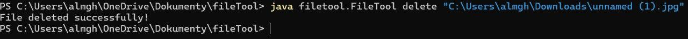
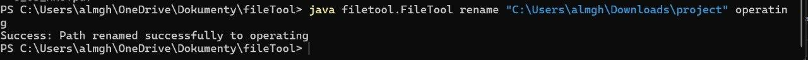

# Command-Line-File-Utility
## Project Overview
A comprehensive Java-based command-line utility designed to perform essential file system operations. This tool provides an intuitive interface for managing files and directories through simple commands.
Project Type: Command Line Interface (CLI) Application  
Language: Java .

## Features
 Help Command - Display all available commands with usage examples  
 List Files - View all files and subdirectories in a directory  
 Copy Files - Duplicate files from source to destination  
 Move Files - Relocate files between directories  
 Delete Files/Directories* - Remove files or empty directories safely  
 Rename Files - Change file names with validation  
 Comprehensive Error Handling - Clear, user-friendly error messages  
 Input Validation - Prevents invalid operations and empty inputs
 
## Technical Requirements
- *Java Development Kit (JDK):* Version 8
- *Operating System:* Windows, or Linux
- *Command Line Interface:* Terminal, CMD
- *Uses java.nio.file for efficient file handling*

## Project Structure
filetool/
│
├── FileTool.java        // Main class & command parser
├── ListOption.java      // List directory contents
├── CopyOption.java      // File copy functionality
├── MoveOption.java      // File moving functionality
├── DeleteOption.java    // File/directory deletion
├── RenameOption.java    // File renaming
└── README.md            // Documentation

## Help Command
Description: Display all available commands and their usage.
Examples :

Error Handling :

## List Files Command
Description: Display all files and subdirectories in a specified directory.
Examples :

Error Handling:

## Copy File Command
Description: Copy a file from source to destination.
Examples :

Error Handling :

## Move File Command
Description: Move a file from one location to another.
Examples :

Error Handling

## Delete File/Directory Command
Description: Permanently delete a file or empty directory.
Examples :

Error Handling :
1.	The delete command checks if a valid <path> is provided.
	2.	It verifies that the file or directory exists and that permission is granted.
	3.	If the target is a directory, it ensures the directory is empty before deleting.
	4.	It attempts the deletion and displays success or error messages depending on the result.
	5.	Any exceptions are handled and displayed to the user.

## Rename File Command
Description: Change the name of a file or directory.
Examples :

Error Handling :
1.	The rename command checks if both <path> and <newname> are provided.
	2.	If the inputs are valid, it calls the renameFile() method.
	3.	If any argument is missing or an unknown command is entered, it shows an error message with usage instructions.

## How to run :
- Download the project file and save it into a folder on your computer.
- Open Command Line (CMD) and navigate to the folder where the file is located using the command:

*cd <folder_path>*

- To run the tool, type:

*java FileTool [command][arguments]*

## 👥 Team Members & Contributions

| Name | Role & Responsibilities |

| رنا المغذوي 4455260| Project Coordinator & Help Command Implementation |

| سماهر سعد 4470216| List & Rename Commands Implementation |

| افنان خالد 4451298| Copy Command Implementation |

| لانا خريص 4453548| Move Command Implementation |

| سعاد سعود 4453256| Delete Command Implementation & README file|

Course: CYB345 - Operating Systems  

